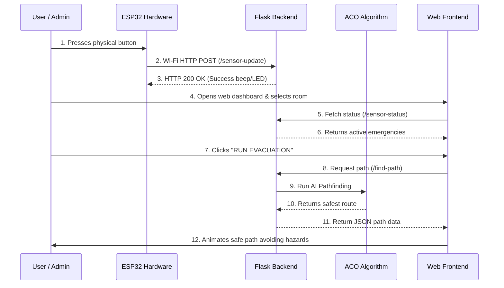

# Smart Emergency Evacuation System: Detailed Workflow Complete Guide

This document provides a highly detailed, step-by-step explanation of exactly what happens in the Smart Emergency Evacuation System, starting from the moment a user presses a physical button on the hardware, all the way to the frontend visualization and AI pathfinding.

---

## 🏗️ System Architecture Overview

Before diving into the steps, here is a high-level visual representation of how the components communicate:



---

## 🏃 Detailed Step-by-Step Flow

### Phase 1: The Hardware Interaction (ESP32)

**1. The Physical Button Press**
*   **What you do:** You physically press one of the 30 tactile buttons on the ESP32 breadboard matrix.
*   **What happens internally:** The ESP32 is constantly "scanning" the rows and columns of the button matrix (running hundreds of times per second). When you press a button, it completes a circuit between a specific Row pin and Column pin.
*   **Data Translation:** The ESP32 firmware detects this electrical connection and translates it into a specific grid coordinate (e.g., Row 2, Col 3). This coordinate maps to a specific corridor ID in the building perfectly.

**2. Determining the Emergency Type**
*   **Cycling Status:** The ESP32 maintains the "state" of each button. If you press it for the first time, it registers as `FIRE`. If you press the *same* button again, it cycles to `SMOKE`, then `GAS`, `BLOCKAGE`, `CROWD`, and eventually cycles back to "CLEAR". 
*   **Visual Feedback:** The ESP32 instantly lights up its built-in LEDs and emits a short beep from the buzzer to confirm your press was registered.

**3. Wi-Fi Transmission**
*   **Data Packaging:** The ESP32 takes the Corridor ID and Emergency Type and formats it into a JSON package. It looks something like this:
    ```json
    {
      "sensor_id": "corridor_12",
      "type": "FIRE",
      "status": "active"
    }
    ```
*   **Sending Data:** Using its onboard Wi-Fi chip, the ESP32 connects to the local network and fires off an **HTTP POST request** to your Flask Backend server at the `/sensor-update` endpoint.

---

### Phase 2: The Backend Processing (Flask API)

**4. Receiving the Emergency Data**
*   **The Listener:** Your Python Flask server is running in the background, listening on port 5000. It receives the HTTP request from the ESP32.
*   **State Update:** The backend parses the JSON data and updates its internal memory (usually a list or dictionary of active emergencies). It marks `corridor_12` as an active hazard zone.
*   **Acknowledgment:** The backend sends a `200 OK` success response back to the ESP32. (If the ESP32 receives this, it flashes a green LED; if it fails, it flashes red and retries).

---

### Phase 3: The User Interface (Web Dashboard)

**5. Loading the Dashboard**
*   **What you do:** You open your browser and navigate to `http://localhost:5000`.
*   **What happens internally:** The browser downloads the HTML, CSS, and JavaScript. Immediately upon loading, the JavaScript (`interactivity.js` / `renderer.js`) makes a silent HTTP GET request to `/layout` to get the building's floor plan, and another request to `/sensor-status` to check for active emergencies.
*   **Map Generation:** The canvas draws the digital building blueprint on your screen.

**6. Live Synchronization**
*   **Real-time Polling / Websockets:** The frontend JavaScript continuously asks the backend every few seconds: *"Are there any new emergencies?"* 
*   **Visualizing Hazards:** Since the backend logged `corridor_12` as a `FIRE`, the frontend receives this via the `/sensor-status` API. The JavaScript highlights that specific corridor on your screen in **Red** (and adds a pulsing/flashing effect if implemented) so administrators can visually see the issue. 

---

### Phase 4: The Evacuation Intelligence (ACO AI)

**7. Triggering the Evacuation Request**
*   **What you do:** You click on a starting room on the digital map (e.g., "Room 101") and click the **"RUN EVACUATION"** button.
*   **What happens internally:** The frontend bundles up your current location and sends a POST request to the backend's `/find-path` endpoint.

**8. Ant Colony Optimization (ACO) Execution**
*   **Algorithm Wake Up:** The Flask server hands the request to `aco.py` (your AI module). 
*   **Swarm Simulation:** The AI spawns hundreds of digital "ants" representing people navigating the building graph map. These ants dynamically explore paths from the starting room to the nearest exit.
*   **Evaluating Danger:** When ants approach a path, they check the "weight" or "pheromone" score of the corridor. 
    *   *Normal Corridors:* Easy to walk through, standard weight.
    *   *Hazard Corridors (e.g., corridor_12 with FIRE):* The system mathematically multiplies its traversal cost by a massive number. 
*   **Finding the Optimum:** The ants inherently avoid the heavily penalized, hazardous routes. Within a few milliseconds, the algorithm compares the successful ants' routes and determines the absolute shortest, *safest* path that entirely bypasses the fire.

**9. Returning the Safe Route**
*   **Data Formulation:** The algorithm returns an ordered list of coordinate waypoints (e.g., `Room 101 -> Corridor 2 -> Corridor 5 -> North Exit`). The backend sends this JSON list back to the frontend browser.

---

### Phase 5: The Final Visualization

**10. Animating the Path**
*   **What you see:** Upon receiving the safe route coordinates from the backend, the JavaScript canvas draws a glowing, animated line starting from your selected room, weaving through only the safe corridors, strictly avoiding the red hazard zone, and leading out the exit door.
*   **Dynamic Recalculation:** If someone presses another physical button on the ESP32 matrix *while* you are looking at the path, the backend updates, the frontend detects the new hazard on its next data poll, and forces the displayed path to instantly recalculate and redraw on the screen in real-time.

---

> [!TIP]
> **Summary of the Entire System Purpose:**
> *   **ESP32 Firmware:** Acts as the *nervous system*, sensing the physical emergency and translating a physical button press to a digital signal.
> *   **Flask Backend:** Acts as the *spinal cord*, transmitting memory, state, and routing APIs.
> *   **ACO Algorithm:** Represents the *brain*, calculating the smartest, fastest, and safest way out dynamically.
> *   **Web Dashboard:** Acts as the *face*, communicating the final instruction visually in an easy-to-understand map.
